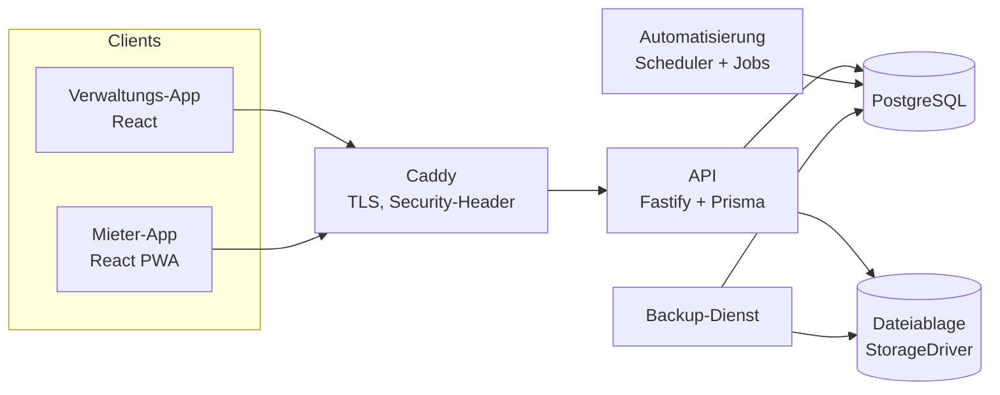
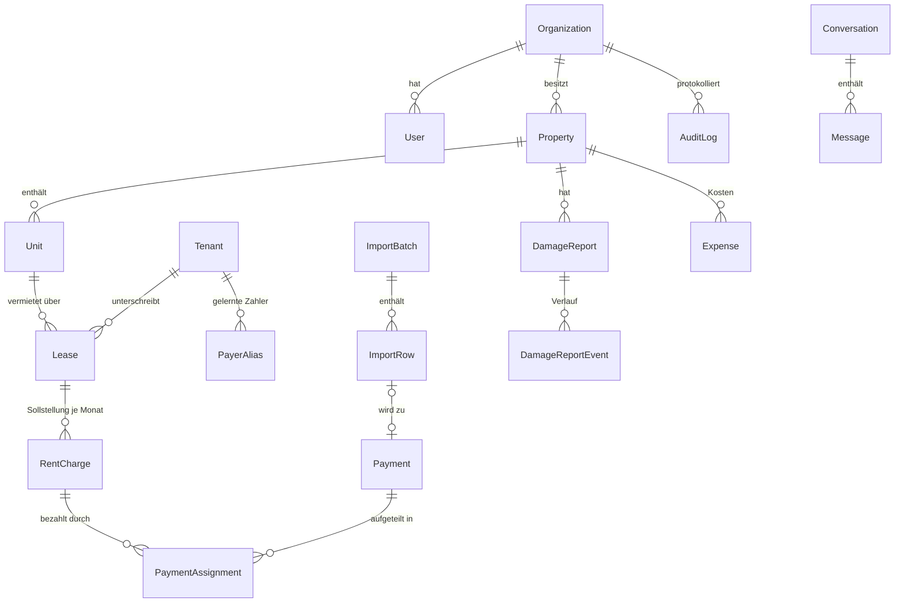

# Architektur

## Überblick

- **Frontend und Backend sind getrennt.** Beide Apps sprechen ausschliesslich mit der versionierten REST-API (`/api/v1`).
- **Gemeinsame Fachlogik** (Rollen, Berechtigungen, Geldformat, Perioden, Bezeichnungen) liegt in `packages/shared` und wird von API und Apps gleichermassen verwendet.
- **Die API ist modular aufgebaut**: `modules/*` (HTTP-Routen je Fachbereich), `services/*` (Fachlogik und Transaktionen), `import/*` (Parser und Matching-Engine als reine, getestete Funktionen) und `automation/*` (Jobs, Scheduler, Hooks).

## Datenmodell

Verknüpfungskette für jeden Franken: **Immobilie → Wohnung → Mietvertrag → Mieter → Sollstellung (Monat) ← Zuordnung ← Zahlung**

Tabellen: `Organization, User, PropertyAccess, RefreshToken, Property, Unit, Tenant, Lease, RentCharge, Payment, PaymentAssignment, ImportBatch, ImportRow, PayerAlias, Document, DamageReport, DamageReportEvent, Conversation, ConversationParticipant, Message, Announcement, Task, Appointment, Notification, Expense, ServiceProvider, AuditLog, AutomationRun, SyncJob, Counter`.

### Grundsätze für korrekte Finanzdaten

1. **Beträge als Ganzzahl in Rappen**: keine Fliesskomma-Rundungsfehler.
2. **Single Source of Truth**: Der bezahlte Betrag einer Sollstellung wird immer aus den Zuordnungen nicht stornierter Zahlungen berechnet (`recalcCharge`).
3. **Serialisierbare Transaktionen** mit automatischer Wiederholung bei Konflikten für alle Buchungen (`financialTx`).
4. **Nichts wird gelöscht**: Zahlungen werden storniert (mit Grund), nicht entfernt. Belege von Buchungen sind nicht löschbar.
5. **Audit-Log** mit alten und neuen Werten für jede finanzielle Änderung.
6. **Keine ungeprüften Buchungen**: Die Automatik schlägt vor, verbucht wird nur nach ausdrücklicher Bestätigung. Vor dem Verbuchen prüft das System erneut, ob sich offene Beträge seit der Analyse verändert haben.
7. **Duplikatschutz**: Fingerprint (Datum, Betrag, Zahler, Referenz) und Ähnlichkeitsprüfung (gleicher Vertrag, gleicher Betrag, ±5 Tage).
8. **Sollstellungen ab Stichtag**: Bestehende Verträge erzeugen keine rückwirkenden Forderungen.

## Einlesen von Kontoauszügen

| Eingang | Verarbeitung |
|---|---|
| PDF mit Textebene | pdf.js liest Text **mit x-Positionen** → Spalten Belastung/Gutschrift/Saldo werden erkannt |
| Eingescannter Ausdruck (PDF ohne Text) / Foto (JPG, PNG) | poppler rendert 300 dpi → Tesseract (Deutsch) liefert Wörter mit Positionen → gleiche Spaltenerkennung |
| Eingefügter Text | Wortpositionen aus Zeichenabständen; Spalten nur bei ausgerichtetem Text, sonst Richtung über Saldo/Schlüsselwörter |
| camt.053/054, CSV, Excel | strukturierte Parser |

**Saldo-Kontrolle** (`verifyByBalance`): Saldo nach Buchung − Saldo davor muss ± Betrag ergeben. Stimmt die Rechnung, sind Betrag **und** Richtung unabhängig vom Layout bestätigt (✓). Abweichungen – z. B. Lesefehler der Texterkennung – werden markiert und können nie „bereit“ sein. Bei Scans/Fotos ist ohne Saldo-Bestätigung immer eine manuelle Prüfung nötig.

## Zahlungsautomatik (Matching-Engine)

`apps/api/src/import/matching.ts` ist eine reine Funktion:

1. **Zahler erkennen**: IBAN, Zahlungs-/QR-Referenz des Vertrags, gelernte Zahlernamen, Namensvergleich (voll, Initiale + Nachname, nur Nachname, Firma), jeweils mit Normalisierung von Umlauten und Reihenfolge.
2. **Betrag vergleichen**: exakter offener Sollbetrag, vertragliche Monatsmiete, mehrere Monate, Abweichung ≤ 2 %, Teil- oder Überzahlung.
3. **Monat bestimmen**: aus der Mitteilung erkannte Monate (Deutsch, Französisch, Englisch, numerisch), sonst der älteste offene Monat, sonst Vorauszahlung.
4. **Aufteilen**: Startmonat, dann FIFO. Ein Restbetrag wird als Guthaben geführt.
5. **Sicherheit berechnen**: 0–99 %. Bei Mehrdeutigkeit gibt es einen Abzug. Status `READY` nur bei hoher Sicherheit **und** exakt passendem Betrag. Die Schwellenwerte sind in den Einstellungen konfigurierbar.

**Lernlogik**: Bestätigte oder korrigierte Zuordnungen werden als `PayerAlias` (Name + IBAN → Mieter) gespeichert. Korrekturen entfernen widersprechende Aliase.

## Rechte- und Rollensystem

Definiert in `packages/shared/src/roles.ts` (Berechtigungen) und durchgesetzt in der API (`auth/context.ts`):

| Rolle | Umfang |
|---|---|
| Super Admin, Eigentümer | alle Funktionen der Organisation |
| Verwalter | alles ausser Organisationseinstellungen |
| Mitarbeiter | operative Arbeit inkl. Finanzen lesen, **nur freigeschaltete Immobilien** |
| Hauswart | Mängel, Aufgaben, Termine, Nachrichten, **keine Finanzdaten**, nur freigeschaltete Immobilien |
| Mieter | ausschliesslich Mieter-API (`/portal/*`), `tenantId` stammt immer aus dem Token |
| Handwerker/Dienstleister | nur zugewiesene Tickets |

Filterparameter schränken den Datenumfang nur ein und können ihn nie erweitern (`scopedPropertyId`). Integrationstests sichern das ab.

## Sicherheit

- Access-Token (JWT, 15 Min.) nur im Arbeitsspeicher; rotierende Refresh-Tokens als httpOnly/SameSite=strict-Cookie, pro App getrennt, mit Wiederverwendungserkennung.
- bcrypt-Hashes, Passwortrichtlinie, Kontosperre nach 5 Fehlversuchen, Rate-Limits, Timing-Schutz bei unbekannten E-Mails.
- Helmet-Header, CORS-Whitelist, TLS über Caddy (HSTS).
- Uploads: Grössenlimit, Endungs-Whitelist und Prüfung der Dateisignatur (Magic Bytes), Speicherung unter zufälligen Schlüsseln ausserhalb des Webroots, Auslieferung nur über berechtigte Endpunkte.
- Strukturierte Fehlerprotokollierung (pino) mit Request-ID; sensible Felder werden geschwärzt.

## Skalierung & Erweiterbarkeit

- Mandantenfähig (`organizationId` auf allen Tabellen), zustandslose API, horizontal skalierbar.
- `StorageDriver`-Schnittstelle (lokal, später S3/Azure), `Dispatcher` für Benachrichtigungskanäle (E-Mail, SMS, Push, WhatsApp).
- Neue Importformate: Parser liefern `ParsedTransaction[]`; die Matching-Engine bleibt unverändert.
- Jobs der Automatisierung sind als `JobDefinition` registriert und lassen sich leicht ergänzen.
